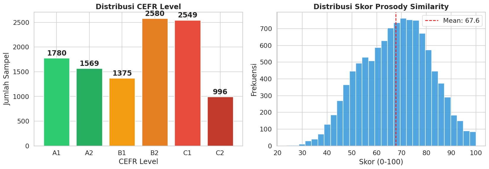
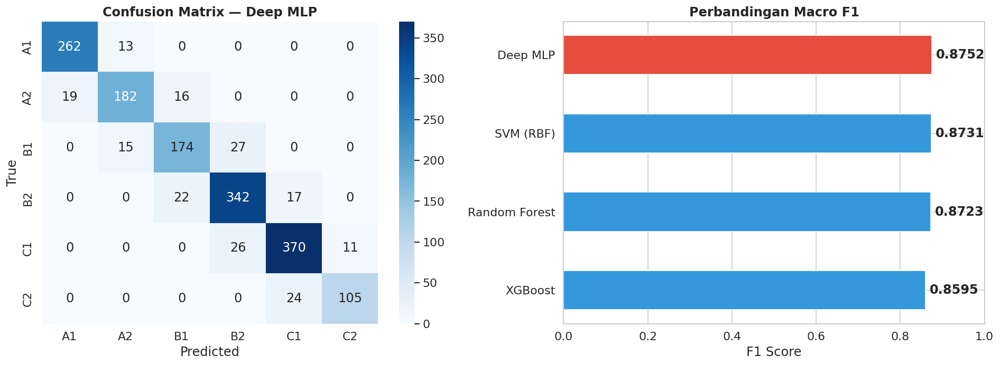
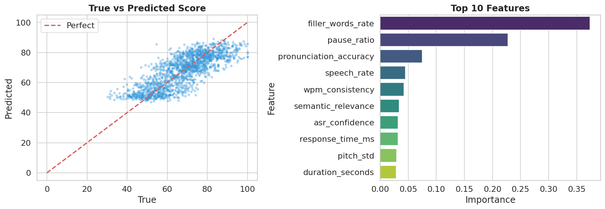
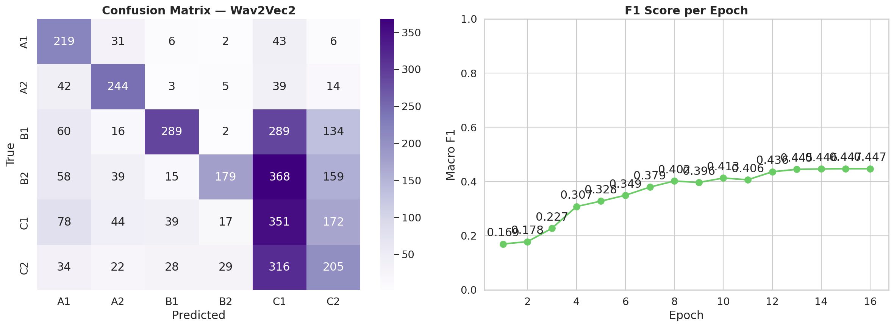
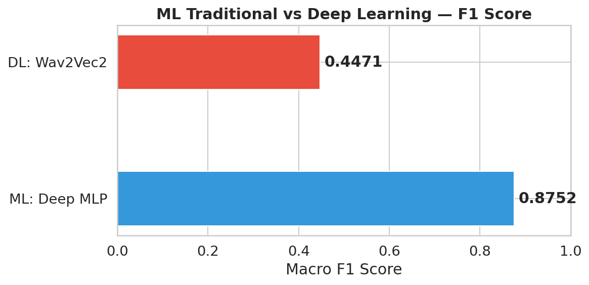

# Implementasi Kecerdasan Buatan untuk Penilaian Otomatis Kemampuan Berbicara Bahasa Inggris Berbasis Kerangka CEFR: Pendekatan Machine Learning dan Deep Learning

---

**Abstrak** — Makalah ini menyajikan implementasi sistem kecerdasan buatan bernama *CEFR Speech Coach* yang dirancang untuk menilai kemampuan berbicara bahasa Inggris secara otomatis berdasarkan kerangka *Common European Framework of Reference for Languages* (CEFR). Sistem ini mengintegrasikan dua pendekatan utama: (1) *Machine Learning* tradisional menggunakan algoritma XGBoost, Random Forest, SVM dengan kernel RBF, dan Deep MLP untuk klasifikasi tingkat CEFR (A1–C2) serta Random Forest Regressor untuk prediksi skor prosodi; dan (2) *Deep Learning* menggunakan model Wav2Vec2 yang di-*fine-tune* dengan teknik LoRA (*Low-Rank Adaptation*). Fitur yang digunakan meliputi fitur prosodi (pitch, energi, durasi, kecepatan bicara), fitur linguistik (akurasi pengucapan, tingkat filler words, pause ratio), dan fitur fluensi. Dataset dibangun dari kosakata Oxford 3000 dan Oxford 5000 dengan simulasi fitur prosodi multi-pembicara. Hasil eksperimen menunjukkan bahwa model Deep MLP mencapai akurasi 88,31% dan F1-score makro 0,8752 pada klasifikasi CEFR, sedangkan model Wav2Vec2 dengan LoRA mencapai akurasi 41,34% dan F1-score makro 0,4471 pada data audio nyata. Model regresi Random Forest untuk prediksi skor prosodi memperoleh RMSE 8,2388 dan R² 0,6301.

**Kata Kunci** — CEFR, *Speech Assessment*, *Machine Learning*, *Deep Learning*, Wav2Vec2, LoRA, Penilaian Pengucapan, *Automated Speech Scoring*

---

## 1 Pendahuluan

### 1.1 Latar Belakang

Kemampuan berbicara dalam bahasa Inggris merupakan salah satu kompetensi komunikatif yang paling penting di era globalisasi saat ini. Seiring dengan perkembangan teknologi informasi dan komunikasi, kebutuhan akan penguasaan bahasa Inggris secara lisan semakin meningkat, baik dalam konteks akademik, profesional, maupun kehidupan sehari-hari [1]. Namun, penilaian kemampuan berbicara secara konvensional masih sangat bergantung pada evaluator manusia yang memiliki keterbatasan dalam hal konsistensi, skalabilitas, dan ketersediaan [2].

*Common European Framework of Reference for Languages* (CEFR) merupakan standar internasional yang digunakan secara luas untuk mengukur kemampuan berbahasa, yang membagi kemampuan ke dalam enam tingkatan: A1 (*Breakthrough*), A2 (*Waystage*), B1 (*Threshold*), B2 (*Vantage*), C1 (*Effective Operational Proficiency*), dan C2 (*Mastery*) [6][7]. Meskipun kerangka CEFR telah diakui secara global, proses penilaian yang sesuai standar ini masih memerlukan tenaga ahli dan waktu yang signifikan.

Perkembangan kecerdasan buatan (*Artificial Intelligence*), khususnya dalam bidang *Machine Learning* dan *Deep Learning*, membuka peluang baru untuk mengotomatisasi proses penilaian kemampuan berbicara [4]. Teknologi *Automatic Speech Recognition* (ASR) dan *Natural Language Processing* (NLP) memungkinkan ekstraksi fitur-fitur linguistik dan prosodi dari sinyal ucapan yang dapat digunakan untuk memprediksi tingkat kemampuan berbahasa seseorang [5].

Penelitian terdahulu menunjukkan bahwa sistem *Computer-Assisted Pronunciation Training* (CAPT) dapat meningkatkan efektivitas pembelajaran pengucapan bahasa asing [1]. Selain itu, pendekatan berbasis kecerdasan buatan telah terbukti mampu melakukan evaluasi dan penskoran pendidikan secara lebih efisien [4]. Sistem penilaian prosodi otomatis juga telah dikembangkan untuk meningkatkan akurasi penilaian kemampuan berbicara [5].

Berdasarkan latar belakang tersebut, penelitian ini mengembangkan sistem *CEFR Speech Coach* yang mengimplementasikan dua pendekatan kecerdasan buatan: *Machine Learning* tradisional untuk klasifikasi tingkat CEFR berdasarkan fitur prosodi dan linguistik terstruktur, serta *Deep Learning* menggunakan model Wav2Vec2 dengan teknik *fine-tuning* LoRA untuk klasifikasi langsung dari sinyal audio.

### 1.2 Rumusan Masalah

Berdasarkan latar belakang yang telah diuraikan, rumusan masalah dalam penelitian ini adalah sebagai berikut:

1. Bagaimana membangun *pipeline* Machine Learning untuk mengklasifikasikan tingkat kemampuan berbicara bahasa Inggris berdasarkan kerangka CEFR (A1–C2) menggunakan fitur prosodi dan linguistik?
2. Bagaimana mengimplementasikan model Deep Learning berbasis Wav2Vec2 dengan teknik LoRA untuk klasifikasi tingkat CEFR dari sinyal audio?
3. Bagaimana perbandingan kinerja antara pendekatan Machine Learning tradisional dan Deep Learning dalam tugas klasifikasi tingkat CEFR?
4. Fitur-fitur prosodi dan linguistik apa saja yang paling berpengaruh dalam prediksi skor kemampuan berbicara?

### 1.3 Tujuan Penelitian

Tujuan penelitian ini adalah sebagai berikut:

1. Merancang dan mengimplementasikan *pipeline* Machine Learning lengkap untuk klasifikasi tingkat CEFR menggunakan fitur prosodi dan linguistik dari kosakata Oxford 3000/5000.
2. Mengimplementasikan model Deep Learning berbasis Wav2Vec2 dengan teknik *fine-tuning* LoRA (*Low-Rank Adaptation*) untuk klasifikasi tingkat CEFR dari data audio.
3. Membandingkan kinerja model Machine Learning tradisional (XGBoost, Random Forest, SVM, Deep MLP) dengan model Deep Learning (Wav2Vec2) dalam tugas penilaian kemampuan berbicara.
4. Mengidentifikasi fitur-fitur prosodi dan linguistik yang paling berpengaruh dalam prediksi skor kemampuan berbicara berdasarkan analisis *feature importance*.

### 1.4 Manfaat Penelitian

Manfaat penelitian ini meliputi:

1. **Manfaat Teoritis**: Memberikan kontribusi pengetahuan tentang penerapan Machine Learning dan Deep Learning dalam penilaian otomatis kemampuan berbicara bahasa Inggris berbasis kerangka CEFR, serta memberikan perbandingan empiris antara kedua pendekatan tersebut.
2. **Manfaat Praktis**: Menghasilkan model AI yang dapat diintegrasikan ke dalam sistem pembelajaran bahasa Inggris adaptif, sehingga memungkinkan penilaian kemampuan berbicara secara real-time tanpa memerlukan evaluator manusia.
3. **Manfaat Metodologis**: Menyajikan metodologi pembangunan dataset prosodi dari kosakata bertingkat CEFR, teknik pencegahan *data leakage* melalui *speaker-independent split*, serta strategi *fine-tuning* model *pre-trained* dengan LoRA untuk efisiensi parameter.

---

## 2 Tinjauan Pustaka

### 2.1 Kecerdasan Buatan (*Artificial Intelligence*)

Kecerdasan buatan (AI) adalah cabang ilmu komputer yang bertujuan menciptakan sistem yang mampu menjalankan tugas-tugas yang biasanya memerlukan kecerdasan manusia, seperti pengenalan pola, pengambilan keputusan, dan pemahaman bahasa alami [4]. Dalam konteks pendidikan, AI telah digunakan untuk evaluasi dan penskoran otomatis yang dapat meningkatkan efisiensi dan objektivitas proses penilaian. Ma (2024) menunjukkan bahwa pendekatan berbasis AI mampu melakukan evaluasi pendidikan secara lebih konsisten dibandingkan dengan metode konvensional [4].

### 2.2 Machine Learning

*Machine Learning* (ML) merupakan subbidang dari kecerdasan buatan yang memungkinkan komputer untuk belajar dari data tanpa diprogram secara eksplisit [4]. Dalam konteks penilaian kemampuan berbahasa, ML digunakan untuk mengklasifikasikan tingkat kemampuan berdasarkan fitur-fitur yang diekstraksi dari ucapan. Algoritma ML yang umum digunakan meliputi *Support Vector Machine* (SVM), *Random Forest*, XGBoost, dan *Multi-Layer Perceptron* (MLP) [2][5].

Chaib *et al.* (2023) mengevaluasi sistem *Computer-Assisted Language Learning* yang menggunakan teknik ML untuk menilai kemampuan bahasa secara otomatis, dan menemukan bahwa pendekatan ML dapat memberikan umpan balik yang cepat dan akurat kepada pelajar [2]. Teknik *ensemble learning* seperti Random Forest dan *gradient boosting* (XGBoost) telah menunjukkan performa yang baik dalam tugas klasifikasi teks dan ucapan [5].

### 2.3 Deep Learning

*Deep Learning* (DL) merupakan subbidang *Machine Learning* yang menggunakan jaringan saraf tiruan (*neural network*) dengan banyak lapisan (*layers*) untuk mempelajari representasi data secara hierarkis [4]. Model *Deep Learning* seperti *Transformer* dan *Convolutional Neural Network* (CNN) telah merevolusi bidang pemrosesan sinyal audio dan ucapan.

Model Wav2Vec2, yang dikembangkan oleh Baevski *et al.* (2020), merupakan model *self-supervised learning* yang mampu mempelajari representasi dari sinyal audio mentah (*raw audio*) [8]. Model ini menggunakan arsitektur *Transformer encoder* dan telah menunjukkan performa yang sangat baik dalam berbagai tugas pemrosesan ucapan, termasuk *Automatic Speech Recognition* (ASR). Teknik *fine-tuning* parameter-efisien seperti LoRA (*Low-Rank Adaptation*) memungkinkan adaptasi model *pre-trained* berskala besar dengan biaya komputasi yang jauh lebih rendah [9].

### 2.4 Penilaian Kemampuan Berbicara (*Speech Assessment*)

Penilaian kemampuan berbicara merupakan proses evaluasi terhadap aspek-aspek produksi lisan, meliputi pengucapan, kelancaran, kosakata, tata bahasa, dan prosodi [1]. Secara tradisional, penilaian ini dilakukan oleh penguji manusia menggunakan rubrik dan skala penilaian yang telah ditetapkan. Namun, pendekatan tradisional ini memiliki beberapa keterbatasan, termasuk subjektivitas antar-penguji, biaya tinggi, dan keterbatasan skalabilitas [5].

Wang *et al.* (2024) menunjukkan bahwa penilaian otomatis terhadap prosodi dapat ditingkatkan secara signifikan menggunakan teknik *deep learning*, dengan mempertimbangkan aspek-aspek seperti intonasi, tekanan kata, dan ritme bicara [5]. Sistem penilaian otomatis tersebut mampu memberikan umpan balik yang konsisten dan dapat direproduksi.

### 2.5 Kerangka CEFR (*Common European Framework of Reference for Languages*)

CEFR merupakan kerangka standar yang dikembangkan oleh Dewan Eropa untuk mendeskripsikan kemampuan berbahasa [6][7]. Kerangka ini membagi kemampuan bahasa ke dalam enam tingkatan yang terbagi ke dalam tiga kelompok:

- **Pengguna Dasar (*Basic User*)**: A1 (*Breakthrough*) dan A2 (*Waystage*)
- **Pengguna Mandiri (*Independent User*)**: B1 (*Threshold*) dan B2 (*Vantage*)
- **Pengguna Mahir (*Proficient User*)**: C1 (*Effective Operational Proficiency*) dan C2 (*Mastery*)

Wolfer dan Lew (2025) serta Zhang dan Lu (2025) menunjukkan bahwa daftar kosakata bertingkat CEFR dapat digunakan sebagai dasar untuk merancang materi pembelajaran dan sistem penilaian yang adaptif [6][7]. Penelitian ini menggunakan daftar kosakata Oxford 3000 dan Oxford 5000 yang telah dikategorikan berdasarkan tingkat CEFR sebagai sumber data utama.

### 2.6 Penilaian Pengucapan (*Pronunciation Assessment*)

Penilaian pengucapan merupakan komponen kritis dalam evaluasi kemampuan berbicara bahasa asing. Amrate dan Tsai (2025) melakukan tinjauan sistematis terhadap sistem *Computer-Assisted Pronunciation Training* (CAPT) dan menemukan bahwa teknologi ini efektif dalam meningkatkan kualitas pengucapan pelajar bahasa asing [1]. Fitur-fitur yang umumnya digunakan dalam penilaian pengucapan meliputi akurasi fonem, prosodi (intonasi, tekanan, ritme), dan kualitas vokal.

### 2.7 Penilaian Otomatis Kemampuan Berbicara (*Automated Speech Scoring*)

*Automated Speech Scoring* (ASS) mengacu pada penggunaan teknologi komputasi untuk menilai kualitas ucapan secara otomatis [5]. Sistem ASS modern biasanya menggabungkan komponen *Automatic Speech Recognition* (ASR), ekstraksi fitur akustik dan linguistik, serta model *Machine Learning* atau *Deep Learning* untuk memprediksi skor kemampuan berbicara [2].

Chan dan Lo (2024) menyoroti potensi gamifikasi dan teknologi adaptif dalam meningkatkan instruksi EFL/ESL, termasuk penggunaan sistem penilaian otomatis untuk memberikan umpan balik instan kepada pelajar [3]. Integrasi teknologi penilaian otomatis dengan kerangka CEFR memungkinkan penciptaan sistem pembelajaran yang benar-benar adaptif dan personal.

---

## 3 Metodologi Penelitian

Metodologi penelitian ini terbagi menjadi dua bagian utama: (A) implementasi *Machine Learning* tradisional untuk klasifikasi tingkat CEFR berdasarkan fitur prosodi dan linguistik terstruktur, dan (B) implementasi *Deep Learning* menggunakan model Wav2Vec2 dengan teknik *fine-tuning* LoRA untuk klasifikasi langsung dari sinyal audio. Seluruh penjelasan pada bagian ini didasarkan sepenuhnya pada *source code* yang terdapat dalam notebook `CEFR Speech Coach.ipynb` dan folder `AI/`.

### 3.1 Machine Learning (Part A)

#### 3.1.1 Akuisisi dan Parsing Data Kosakata

Tahap pertama dalam pipeline ML adalah ekstraksi kosakata bertingkat CEFR dari dokumen PDF Oxford. Implementasi ini terdapat pada file `parse_oxford_pdf.py`. Sistem mem-parsing dua dokumen PDF:

- *American Oxford 3000 CEFR Levels.pdf*
- *American Oxford 5000 by CEFR Level.pdf*

Proses parsing menggunakan library `pdfplumber` untuk mengekstrak kata-kata dari dokumen PDF multi-kolom. Berikut adalah potongan kode utama proses parsing:

```python
def parse_pdf(pdf_path):
    all_entries = []
    current_cefr_level = 'Unknown'
    with pdfplumber.open(pdf_path) as pdf:
        for page_num, page in enumerate(pdf.pages, 1):
            words = page.extract_words(keep_blank_chars=True)
            # Cluster words into columns based on x0 coordinate
            col1 = [w for w in words if w['x0'] < 100]
            col2 = [w for w in words if 100 <= w['x0'] < 230]
            col3 = [w for w in words if 230 <= w['x0'] < 360]
            col4 = [w for w in words if w['x0'] >= 360]
            # Reconstruct and merge wrapped lines per column
            ...
```

Proses ini mencakup:

1. **Pengelompokan kata berdasarkan kolom** menggunakan koordinat horizontal (`x0`) dengan threshold 100, 230, dan 360 piksel.
2. **Penggabungan baris terbungkus** (*wrapped lines*) untuk *Part-of-Speech* tags yang terpisah baris menggunakan fungsi `merge_wrapped_lines()`.
3. **Deteksi penanda level CEFR** (A1, A2, B1, B2, C1, C2) dan metadata halaman.
4. **Pembersihan kata** termasuk penghapusan indeks homonim, deskripsi dalam kurung, dan karakter non-alfanumerik.
5. **Deduplikasi**: Kata yang muncul di beberapa sumber digabungkan dengan mempertahankan level CEFR terendah.

Hasil parsing disimpan sebagai file `oxford_vocabulary.csv`.

#### 3.1.2 Generasi Dataset Prosodi

Setelah kosakata diekstrak, dataset prosodi dan linguistik digenerate secara sintetis menggunakan file `generate_dataset.py`. Dataset ini menyimulasikan fitur-fitur akustik dan linguistik dari 150 pembicara berbeda dalam 35 skenario percakapan yang dikelompokkan ke dalam 8 kategori:

1. *Daily Life* (5 skenario)
2. *Workplace & Business* (5 skenario)
3. *Academic* (5 skenario)
4. *Social & Leisure* (5 skenario)
5. *Public Services* (5 skenario)
6. *Emergency & Health* (4 skenario)
7. *Phone & Virtual* (4 skenario)
8. *Cross-cultural* (3 skenario)

Fitur yang digenerate untuk setiap sampel meliputi:

**Tabel 3.1 — Daftar Fitur Dataset Prosodi**

| No | Nama Fitur | Kategori | Deskripsi |
|----|-----------|----------|-----------|
| 1 | `pitch_mean` | Prosodi | Rata-rata frekuensi dasar (Hz) |
| 2 | `pitch_std` | Prosodi | Deviasi standar frekuensi dasar |
| 3 | `pitch_contour_slope` | Prosodi | Kemiringan kontur intonasi |
| 4 | `energy_rms` | Prosodi | Energi RMS sinyal audio |
| 5 | `duration_seconds` | Prosodi | Durasi ucapan (detik) |
| 6 | `speech_rate` | Prosodi | Kecepatan bicara (suku kata/detik) |
| 7 | `response_time_ms` | Prosodi | Waktu respons (milidetik) |
| 8 | `lexical_diversity` | Linguistik | Rasio keragaman leksikal |
| 9 | `grammar_error_rate` | Linguistik | Tingkat kesalahan tata bahasa |
| 10 | `pronunciation_accuracy` | Linguistik | Akurasi pengucapan (0–100) |
| 11 | `pause_ratio` | Fluensi | Rasio durasi jeda terhadap total durasi |
| 12 | `filler_words_rate` | Fluensi | Tingkat *filler words* (uh, um) per kata |
| 13 | `wpm_consistency` | Fluensi | Konsistensi kecepatan bicara |
| 14 | `asr_confidence` | Fluensi | Tingkat kepercayaan ASR |
| 15 | `semantic_relevance` | Linguistik | Kemiripan semantik dengan jawaban ideal (0–100) |
| 16 | `whisper_feat_1` | Representasi | Fitur representasi *pre-trained* dimensi 1 |
| 17 | `whisper_feat_2` | Representasi | Fitur representasi *pre-trained* dimensi 2 |
| 18 | `whisper_feat_3` | Representasi | Fitur representasi *pre-trained* dimensi 3 |
| 19 | `user_prior_score` | Konteks | Skor historis pengguna |
| 20 | `prosody_similarity` | Target Regresi | Skor kemiripan prosodi (0–100) |

Setiap fitur digenerate menggunakan distribusi normal dengan parameter yang bervariasi berdasarkan level CEFR. Sebagai contoh, untuk fitur `pronunciation_accuracy`:

```python
pronunciation_accuracy = min(100.0, max(0.0,
    np.random.normal(loc=60.0 + level_idx*6.0, scale=5.0)))
```

Formula ini memastikan bahwa pembicara dengan level CEFR lebih tinggi cenderung memiliki akurasi pengucapan yang lebih baik, dengan *mean* yang meningkat 6 poin per level. Bias pembicara (*speaker bias*) juga ditambahkan untuk menyimulasikan variasi antar-individu:

```python
speaker_bias = {spk: np.random.normal(0, 5) for spk in speakers}
```

Selain itu, kosakata C2 yang tidak terdapat dalam PDF Oxford disintesiskan sebanyak 500 kata untuk memastikan keberadaan kelas C2 dalam dataset.

#### 3.1.3 Pembersihan Data (*Data Cleaning*)

Proses pembersihan data diimplementasikan dalam file `clean_data.py` dengan langkah-langkah berikut:

1. **Penghapusan duplikat**: Duplikat berdasarkan kombinasi `word` dan `speaker_id` dihapus, mempertahankan entri terakhir.

```python
df = df.drop_duplicates(subset=['word', 'speaker_id'], keep='last')
```

2. **Penanganan nilai kosong (*missing values*)**: Baris dengan label target kosong (`cefr_level` atau `prosody_similarity`) dihapus. Fitur numerik yang memiliki nilai kosong diimputasi menggunakan nilai median.

```python
for col in numeric_cols:
    if df[col].isnull().any():
        median_val = df[col].median()
        df[col].fillna(median_val, inplace=True)
```

3. **Validasi batas logis**: Data difilter berdasarkan batasan fisik yang masuk akal:
   - Durasi suara minimal 0,1 detik
   - Kecepatan bicara harus positif
   - Waktu respons tidak boleh negatif
   - Skor kemiripan prosodi dalam rentang 0–100

4. **Deteksi dan penanganan outlier**: Metode IQR (*Interquartile Range*) dengan faktor 3,0 digunakan untuk mendeteksi dan menghapus outlier ekstrem pada fitur `pitch_std`, `duration_seconds`, dan `response_time_ms`.

```python
for col in ['pitch_std', 'duration_seconds', 'response_time_ms']:
    Q1 = df[col].quantile(0.25)
    Q3 = df[col].quantile(0.75)
    IQR = Q3 - Q1
    lower_bound = Q1 - 3.0 * IQR
    upper_bound = Q3 + 3.0 * IQR
    df = df[(df[col] >= lower_bound) & (df[col] <= upper_bound)]
```

5. **Normalisasi teks**: Kata dinormalisasi ke huruf kecil dan hanya kata dengan karakter alfanumerik yang valid dipertahankan.

#### 3.1.4 Preprocessing untuk Klasifikasi

Pada tahap preprocessing untuk klasifikasi (Cell 3 notebook), dilakukan penghapusan fitur-fitur yang berpotensi menyebabkan *data leakage*:

```python
drop_cols_classification = [
    'word', 'cefr_level', 'speaker_id', 'scenario_id',
    'prosody_similarity',   # bocor (skor berdasarkan kebenaran)
    'lexical_diversity',    # bocor (korelasi 0.9056)
    'grammar_error_rate',   # bocor (korelasi -0.9089)
    'whisper_feat_1',       # bocor (korelasi 0.9228)
    'whisper_feat_2',       # mungkin juga bocor
    'whisper_feat_3',       # amankan saja
    'user_prior_score'      # bisa jadi bocor
]
```

Fitur-fitur yang dihapus adalah fitur dengan korelasi sangat tinggi (>0,9) terhadap label target, yang dapat menyebabkan kebocoran informasi dan menghasilkan evaluasi yang tidak valid. Setelah penghapusan, dilakukan verifikasi korelasi untuk memastikan tidak ada fitur yang tersisa dengan korelasi >0,9 terhadap label.

Fitur yang digunakan untuk klasifikasi setelah penghapusan (*prosody murni*) meliputi:
- `pitch_mean`, `pitch_std`, `pitch_contour_slope`, `energy_rms`
- `duration_seconds`, `speech_rate`, `response_time_ms`
- `pronunciation_accuracy`, `pause_ratio`, `filler_words_rate`
- `wpm_consistency`, `asr_confidence`, `semantic_relevance`

#### 3.1.5 Strategi Pembagian Data (*Speaker-Independent Split*)

Untuk mencegah *data leakage* akibat kesamaan karakteristik vokal pembicara yang sama, digunakan strategi `GroupShuffleSplit` dari scikit-learn:

```python
gss = GroupShuffleSplit(n_splits=1, test_size=0.15, random_state=42)
train_idx, test_idx = next(gss.split(X, y_class_enc, groups=speakers))
```

Strategi ini memastikan bahwa semua sampel dari pembicara yang sama hanya muncul di set latih atau set uji, tetapi tidak keduanya. Rasio pembagian adalah 85% data latih dan 15% data uji.

#### 3.1.6 Standardisasi Fitur

Standardisasi fitur numerik dilakukan menggunakan `StandardScaler` yang diintegrasikan ke dalam *pipeline* scikit-learn untuk menghindari kebocoran informasi dari set uji ke set latih:

```python
preprocessor = ColumnTransformer(
    transformers=[('num', StandardScaler(), X.columns.tolist())]
)
```

`StandardScaler` melakukan transformasi *z-score* yang menormalkan setiap fitur agar memiliki rata-rata 0 dan deviasi standar 1, yang dinyatakan dengan Persamaan (1):

$$z = \frac{x - \mu}{\sigma}$$

di mana *x* adalah nilai fitur asli, *μ* adalah rata-rata, dan *σ* adalah deviasi standar dari set latih. Dengan mengintegrasikan scaler ke dalam pipeline, parameter *μ* dan *σ* hanya dihitung dari data latih (*fit*) dan kemudian diterapkan (*transform*) ke data uji, sehingga mencegah *data leakage*.

#### 3.1.7 Encoding Label

Label CEFR di-encode menggunakan `LabelEncoder` dari scikit-learn:

```python
le_ml = LabelEncoder()
le_ml.fit(['A1', 'A2', 'B1', 'B2', 'C1', 'C2'])
y_class_enc = le_ml.transform(y_class)
```

Proses encoding memetakan label string ke integer: A1→0, A2→1, B1→2, B2→3, C1→4, C2→5.

#### 3.1.8 Model Klasifikasi

Empat model klasifikasi dilatih dan dievaluasi. Berikut adalah konfigurasi setiap model berdasarkan *source code*:

**Tabel 3.2 — Konfigurasi Model Klasifikasi ML**

| Model | Parameter Utama |
|-------|----------------|
| XGBoost | `n_estimators=100`, `learning_rate=0.1`, `max_depth=5`, `eval_metric='mlogloss'`, `random_state=42` |
| Random Forest | `n_estimators=150`, `max_depth=15`, `min_samples_split=5`, `class_weight='balanced'`, `random_state=42` |
| SVM (RBF) | `kernel='rbf'`, `C=3.0`, `gamma='scale'`, `probability=True`, `random_state=42` |
| Deep MLP | `hidden_layer_sizes=(128, 64)`, `max_iter=200`, `early_stopping=True`, `random_state=42` |

Setiap model diintegrasikan dalam `Pipeline` scikit-learn bersama dengan preprocessor:

```python
pipe = Pipeline(steps=[
    ('preprocessor', preprocessor),
    ('classifier', model)
])
pipe.fit(X_train, y_train_cls)
```

Seleksi model terbaik dilakukan berdasarkan skor F1 *macro*:

```python
f1 = f1_score(y_test_cls, y_pred, average='macro', labels=all_labels)
```

#### 3.1.9 Model Regresi (Prediksi Skor Prosodi)

Selain klasifikasi, model regresi Random Forest dilatih untuk memprediksi skor kemiripan prosodi (*prosody_similarity*) dalam rentang 0–100:

```python
reg_pipeline = Pipeline(steps=[
    ('preprocessor', preprocessor),
    ('regressor', RandomForestRegressor(n_estimators=100, random_state=42, n_jobs=-1))
])
reg_pipeline.fit(X_train, y_train_reg)
```

Model regresi ini menggunakan fitur yang sama dengan model klasifikasi dan dievaluasi menggunakan metrik RMSE, MAE, dan R².

#### 3.1.10 Evaluasi Model ML

Evaluasi model klasifikasi menggunakan metrik berikut:
- **Accuracy**: Proporsi prediksi yang benar terhadap total prediksi
- **F1-Score (Macro)**: Rata-rata harmonis antara *precision* dan *recall*, dihitung rata-rata untuk semua kelas
- **Precision (Macro)**: Proporsi prediksi positif yang benar, rata-rata semua kelas
- **Recall (Macro)**: Proporsi sampel positif aktual yang terdeteksi dengan benar, rata-rata semua kelas

Evaluasi model regresi menggunakan:
- **RMSE** (*Root Mean Squared Error*): Akar kuadrat dari rata-rata kesalahan kuadrat
- **MAE** (*Mean Absolute Error*): Rata-rata kesalahan absolut
- **R²** (*Coefficient of Determination*): Proporsi variansi yang dijelaskan oleh model

#### 3.1.11 Penyimpanan Model

Model-model yang telah dilatih disimpan menggunakan `joblib`:

```python
joblib.dump(best_ml_model, 'models/best_cefr_classifier.pkl')
joblib.dump(le_ml, 'models/label_encoder.pkl')
joblib.dump(reg_pipeline, 'models/prosody_regressor.pkl')
```

Semua model individual juga disimpan: `cefr_xgboost.pkl`, `cefr_random_forest.pkl`, `cefr_svm_rbf.pkl`, dan `cefr_deep_mlp.pkl`.

---

### 3.2 Deep Learning (Part B)

#### 3.2.1 Persiapan Data Audio

Pada bagian Deep Learning (Cell 10–15 notebook), digunakan data audio nyata yang berbeda dari data sintetis pada Part A. Data audio dimuat dari metadata CSV (`audio_metadata.csv`) yang berisi informasi tentang setiap file audio, termasuk `id`, `speaker_id`, `cefr_level`, dan `text`.

Konfigurasi audio yang digunakan:

```python
TARGET_SR = 16000         # Sampling rate target (16kHz)
MAX_DURATION = 3.0        # Durasi maksimal audio (3 detik)
MAX_SAMPLES = 48000       # int(16000 * 3.0)
MIN_AUDIO_SECONDS = 1.0   # Durasi minimal audio (1 detik)
MIN_SAMPLES = 16000       # int(16000 * 1.0)
```

Berdasarkan output notebook, total data audio yang digunakan adalah **28.107 sampel** dengan distribusi kelas sebagai berikut:

**Tabel 3.3 — Distribusi Kelas Data Audio**

| CEFR Level | Train | Test | Total |
|------------|-------|------|-------|
| A1 | 2.312 | 408 | 2.720 |
| A2 | 2.347 | 428 | 2.775 |
| B1 | 5.097 | 923 | 6.020 |
| B2 | 5.318 | 985 | 6.303 |
| C1 | 4.753 | 870 | 5.623 |
| C2 | 3.946 | 720 | 4.666 |
| **Total** | **23.773** | **4.334** | **28.107** |

Pembagian data menggunakan strategi *speaker-independent split* dengan rasio 85:15.

#### 3.2.2 Pemuatan dan Preprocessing Audio

Setiap file audio diproses melalui fungsi `load_audio_safe()`:

```python
def load_audio_safe(audio_path, target_sr=TARGET_SR):
    waveform, orig_sr = torchaudio.load(audio_path)
    waveform = waveform.mean(dim=0).numpy()  # Konversi ke mono
    if orig_sr != target_sr:
        waveform = librosa.resample(y=waveform, orig_sr=orig_sr, target_sr=target_sr)
    if len(waveform) > MAX_SAMPLES:
        waveform = waveform[:MAX_SAMPLES]    # Potong ke 3 detik
    if len(waveform) < MIN_SAMPLES:
        return None                           # Skip jika < 1 detik
    max_val = np.abs(waveform).max()
    if max_val > 0:
        waveform = waveform / max_val         # Normalisasi amplitudo
    return waveform.astype(np.float32)
```

Proses preprocessing audio mencakup:
1. **Pemuatan audio** menggunakan `torchaudio.load()`
2. **Konversi ke mono** dengan merata-ratakan semua channel
3. **Resampling** ke 16kHz menggunakan `librosa.resample()` jika sampling rate asli berbeda
4. **Pemotongan** (*truncation*) ke durasi maksimal 3 detik
5. **Filtrasi** audio yang terlalu pendek (<1 detik)
6. **Normalisasi amplitudo** ke rentang [-1, 1]

Berdasarkan output, dari 23.773 sampel latih yang diproses, terdapat **19.252** yang berhasil dimuat, dan dari 4.334 sampel uji, terdapat **3.597** yang berhasil dimuat.

#### 3.2.3 Arsitektur Model

Model Deep Learning yang digunakan adalah **Wav2Vec2ForSequenceClassification** dari library HuggingFace Transformers, dengan model dasar `facebook/wav2vec2-base`. Arsitektur ini terdiri dari:

1. **Feature Encoder**: CNN multi-layer yang mengekstrak representasi laten dari sinyal audio mentah (dibekukan/*frozen* selama training).
2. **Transformer Encoder**: 12 layer encoder Transformer yang mempelajari representasi kontekstual.
3. **Classification Head**: Layer linear untuk klasifikasi ke 6 kelas CEFR.

```python
w2v_model = Wav2Vec2ForSequenceClassification.from_pretrained(
    'facebook/wav2vec2-base',
    num_labels=6,
    id2label=id2label,
    label2id=label2id,
    problem_type='single_label_classification',
    ignore_mismatched_sizes=True
)
w2v_model.freeze_feature_encoder()  # Bekukan feature encoder
```

#### 3.2.4 Teknik LoRA (*Low-Rank Adaptation*)

Untuk efisiensi parameter, diterapkan teknik LoRA menggunakan library PEFT (*Parameter-Efficient Fine-Tuning*):

```python
from peft import LoraConfig, get_peft_model

peft_config = LoraConfig(
    r=16,                    # Rank LoRA
    lora_alpha=32,           # Scaling factor
    target_modules=["q_proj", "v_proj", "k_proj", "out_proj"],
    lora_dropout=0.1,
    bias="none",
    modules_to_save=["classifier"]
)
w2v_model = get_peft_model(w2v_model, peft_config)
```

**Tabel 3.4 — Konfigurasi LoRA**

| Parameter | Nilai | Keterangan |
|-----------|-------|------------|
| Rank (*r*) | 16 | Dimensi matriks dekomposisi *low-rank* |
| Alpha (*lora_alpha*) | 32 | Faktor skala untuk bobot LoRA |
| Target Modules | `q_proj`, `v_proj`, `k_proj`, `out_proj` | Modul *attention* yang diberi adaptor LoRA |
| Dropout | 0.1 | Dropout pada layer LoRA |
| Bias | none | Tidak melatih parameter bias |
| Modules to Save | `classifier` | Layer classifier dilatih penuh |

Selain LoRA, **dua layer Transformer terakhir** juga di-*unfreeze* untuk memungkinkan *fine-tuning* terbatas:

```python
base_model = w2v_model.base_model.model
for layer in base_model.wav2vec2.encoder.layers[-2:]:
    for param in layer.parameters():
        param.requires_grad = True
```

Berdasarkan output notebook, konfigurasi ini menghasilkan:
- Total parameter: **95.751.308**
- Parameter yang dapat dilatih: **15.356.934** (16,04%)

#### 3.2.5 Penanganan Ketidakseimbangan Kelas (*Class Imbalance*)

Untuk mengatasi ketidakseimbangan distribusi kelas, diterapkan *class weights* manual menggunakan metode *inverse frequency*:

```python
class_weights = np.array([
    total_samples / (num_classes * label_counts[cls])
    for cls in sorted(label_counts.keys())
])
class_weights_tensor = torch.tensor(class_weights, dtype=torch.float).to(device)
```

Berdasarkan output notebook, bobot kelas yang dihasilkan adalah:

**Tabel 3.5 — Bobot Kelas (*Class Weights*)**

| Kelas | Label | Jumlah Sampel | Bobot |
|-------|-------|--------------|-------|
| A1 | 0 | 1.692 | 1.8964 |
| A2 | 1 | 1.891 | 1.6968 |
| B1 | 2 | 4.277 | 0.7502 |
| B2 | 3 | 4.266 | 0.7521 |
| C1 | 4 | 3.764 | 0.8525 |
| C2 | 5 | 3.362 | 0.9544 |

Kelas minoritas (A1, A2) mendapat bobot lebih besar untuk mengkompensasi ketidakseimbangan.

#### 3.2.6 Konfigurasi Training

Training dilakukan menggunakan `WeightedTrainer`, yaitu subkelas dari `Trainer` HuggingFace yang mengoverride fungsi `compute_loss` untuk menggunakan *weighted CrossEntropyLoss*:

```python
class WeightedTrainer(Trainer):
    def compute_loss(self, model, inputs, return_outputs=False, num_items_in_batch=None):
        labels = inputs.pop("labels")
        outputs = model(**inputs)
        logits = outputs.logits
        loss_fct = torch.nn.CrossEntropyLoss(weight=class_weights_tensor)
        loss = loss_fct(logits, labels)
        return (loss, outputs) if return_outputs else loss
```

**Tabel 3.6 — Hyperparameter Training Deep Learning**

| Hyperparameter | Nilai | Keterangan |
|----------------|-------|------------|
| Epoch | 15 | Jumlah iterasi penuh atas dataset |
| Batch size (train) | 2 | Ukuran *mini-batch* per perangkat (training) |
| Batch size (eval) | 2 | Ukuran *mini-batch* per perangkat (evaluasi) |
| Gradient accumulation | 8 | Akumulasi gradien sebelum update (*effective batch size* = 16) |
| Learning rate | 3×10⁻⁵ | Laju pembelajaran awal |
| Warmup ratio | 0.2 | 20% langkah awal untuk *warmup* |
| Weight decay | 0.01 | Regularisasi L2 |
| LR scheduler | Cosine | Penurunan laju pembelajaran mengikuti fungsi kosinus |
| Mixed precision | FP16 | *Half-precision* untuk efisiensi memori |
| Max grad norm | 1.0 | *Gradient clipping* untuk stabilitas |
| Save total limit | 2 | Maksimal 2 *checkpoint* disimpan |
| Metric for best model | `f1_macro` | Metrik untuk seleksi model terbaik |

#### 3.2.7 Metrik Evaluasi Deep Learning

Evaluasi model Deep Learning menggunakan dua metrik utama:

```python
def compute_metrics(eval_pred):
    logits, labels = eval_pred
    preds = np.argmax(logits, axis=-1)
    return {
        'accuracy': acc_metric.compute(predictions=preds, references=labels)['accuracy'],
        'f1_macro': f1_score(labels, preds, average='macro')
    }
```

Metrik `accuracy` dihitung menggunakan library `evaluate` dari HuggingFace, sedangkan `f1_macro` dihitung menggunakan scikit-learn.

#### 3.2.8 Penyimpanan Model Deep Learning

Model Deep Learning disimpan dalam format yang kompatibel dengan HuggingFace:

```python
SAVE_DIR = './cefr-wav2vec2-final'
trainer.save_model(SAVE_DIR)
feat_ext.save_pretrained(SAVE_DIR)
```

File-file yang disimpan meliputi:
- `adapter_config.json` — Konfigurasi LoRA
- `adapter_model.safetensors` — Bobot adaptor LoRA (4,5 MB)
- `label_map.json` — Pemetaan label
- `preprocessor_config.json` — Konfigurasi *feature extractor*
- `training_args.bin` — Argumen training

#### 3.2.9 Alur Inferensi

Berdasarkan *source code* pada Cell 16 notebook, alur inferensi untuk kedua model adalah sebagai berikut:

**Inferensi Part A (Machine Learning):**
1. Menerima input fitur prosodi/linguistik dalam format DataFrame
2. Pipeline melakukan standardisasi fitur (StandardScaler)
3. Model klasifikasi (Deep MLP) menghasilkan prediksi label CEFR
4. Label numerik dikonversi kembali ke label string menggunakan LabelEncoder

**Inferensi Part B (Deep Learning):**
1. Menerima input berupa path file audio
2. Audio dimuat dan diproses (resampling, truncation, normalisasi)
3. Feature extractor mengkonversi waveform ke representasi numerik
4. Model Wav2Vec2 menghasilkan logits
5. Softmax diterapkan untuk mendapatkan probabilitas
6. Label dengan probabilitas tertinggi dipilih sebagai prediksi

```python
def predict_audio(path):
    audio, _ = librosa.load(path, sr=TARGET_SR, mono=True)
    if len(audio) > MAX_SAMPLES:
        audio = audio[:MAX_SAMPLES]
    inputs = feat_ext(audio, sampling_rate=TARGET_SR, max_length=MAX_SAMPLES,
                      truncation=True, padding='max_length', return_tensors='pt')
    inputs = {k: v.to(device) for k, v in inputs.items()}
    w2v_model.eval()
    with torch.no_grad():
        out = w2v_model(**inputs)
    probs = torch.nn.functional.softmax(out.logits, dim=-1)
    pred = torch.argmax(probs, dim=-1).item()
    return id2label[pred], probs[0][pred].item()
```

---

## 4 Hasil dan Pembahasan

### 4.1 Eksplorasi Data (*Exploratory Data Analysis*)

Gambar 4.1 menunjukkan distribusi dataset yang digunakan dalam penelitian ini. Grafik kiri menampilkan distribusi tingkat CEFR pada dataset prosodi, sedangkan grafik kanan menunjukkan distribusi skor *prosody similarity*.

**Gambar 4.1** — Distribusi CEFR Level dan Skor Prosody Similarity



Berdasarkan output notebook, distribusi tingkat CEFR pada dataset prosodi (setelah pembersihan) adalah sebagai berikut:

**Tabel 4.1 — Distribusi Tingkat CEFR pada Dataset Prosodi**

| CEFR Level | Jumlah Sampel |
|------------|--------------|
| A1 | 1.780 |
| A2 | 1.569 |
| B1 | 1.375 |
| B2 | 2.580 |
| C1 | 2.549 |
| C2 | 996 |
| **Total** | **10.849** |

Distribusi menunjukkan ketidakseimbangan kelas, dengan level B2 dan C1 memiliki jumlah sampel terbanyak, sementara level C2 memiliki jumlah sampel paling sedikit. Distribusi skor *prosody similarity* mengikuti distribusi mendekati normal dengan nilai rata-rata (*mean*) sebesar **67,6** dari rentang 0–100.

### 4.2 Hasil Klasifikasi Machine Learning (Part A)

#### 4.2.1 Perbandingan Model

Berdasarkan output training dari notebook, keempat model klasifikasi menunjukkan performa yang kompetitif. Berikut adalah ringkasan hasil evaluasi:

**Tabel 4.2 — Perbandingan Performa Model Klasifikasi ML**

| Model | Accuracy | F1 (Macro) | Precision (Macro) | Recall (Macro) |
|-------|----------|------------|-------------------|----------------|
| XGBoost | 0.8658 | 0.8595 | — | — |
| Random Forest | 0.8775 | 0.8723 | — | — |
| SVM (RBF) | 0.8769 | 0.8731 | 0.8718 | 0.8745 |
| **Deep MLP** | **0.8831** | **0.8752** | **0.8818** | **0.8696** |

Model **Deep MLP** dengan arsitektur *hidden layers* (128, 64) mencapai performa terbaik dengan F1-score makro 0,8752 dan akurasi 88,31%. Keempat model menunjukkan performa yang sangat baik (>85% F1), mengindikasikan bahwa fitur prosodi dan linguistik yang digunakan memiliki daya diskriminatif yang tinggi untuk klasifikasi CEFR.

Gambar 4.2 menampilkan *confusion matrix* model Deep MLP dan perbandingan F1-score keempat model.

**Gambar 4.2** — Confusion Matrix Deep MLP dan Perbandingan Macro F1



#### 4.2.2 Analisis Confusion Matrix (Deep MLP)

Berdasarkan *confusion matrix* yang dihasilkan dari output notebook (Gambar 4.2), analisis per kelas untuk model Deep MLP adalah sebagai berikut:

**Tabel 4.3 — Classification Report Model Deep MLP**

| Kelas | Precision | Recall | F1-Score | Support |
|-------|-----------|--------|----------|---------|
| A1 | 0.93 | 0.95 | 0.94 | 275 |
| A2 | 0.87 | 0.84 | 0.85 | 217 |
| B1 | 0.82 | 0.81 | 0.81 | 216 |
| B2 | 0.87 | 0.90 | 0.88 | 381 |
| C1 | 0.90 | 0.91 | 0.90 | 407 |
| C2 | 0.91 | 0.81 | 0.86 | 129 |
| **Accuracy** | | | **0.88** | **1.625** |
| **Macro Avg** | **0.88** | **0.87** | **0.88** | **1.625** |
| **Weighted Avg** | **0.88** | **0.88** | **0.88** | **1.625** |

Dari *confusion matrix*, beberapa observasi penting:

1. **Level A1** memiliki performa terbaik (F1=0,94) karena fitur-fitur prosodi pada level pemula memiliki karakteristik yang paling distingtif (kecepatan bicara rendah, *pause ratio* tinggi, *filler words* banyak).
2. **Level B1** memiliki performa terendah (F1=0,81) karena berada di zona transisi antara pengguna dasar dan mandiri, di mana perbedaan fitur antar-level menjadi lebih halus.
3. **Kesalahan klasifikasi** paling sering terjadi antara level yang berdekatan (misalnya A2↔B1, B2↔C1), yang konsisten dengan sifat kontinum kemampuan berbahasa.
4. Berdasarkan confusion matrix: A1 memiliki 262 prediksi benar dari 275, A2 memiliki 182 dari 217, B1 memiliki 174 dari 216, B2 memiliki 342 dari 381, C1 memiliki 370 dari 407, dan C2 memiliki 105 dari 129.

### 4.3 Hasil Regresi Skor Prosodi (Part A)

Model regresi Random Forest untuk prediksi skor *prosody similarity* menghasilkan:

**Tabel 4.4 — Metrik Evaluasi Model Regresi**

| Metrik | Nilai |
|--------|-------|
| RMSE | 8.2388 |
| MAE | 6.5779 |
| R² | 0.6301 |

Gambar 4.3 menampilkan scatter plot *True vs. Predicted Score* dan *Feature Importance* model regresi.

**Gambar 4.3** — True vs. Predicted Score dan Top 10 Feature Importance Regresi



Berdasarkan analisis *feature importance* pada Gambar 4.3, fitur-fitur yang paling berpengaruh dalam prediksi skor prosodi adalah:

**Tabel 4.5 — Top 10 Feature Importance (Regresi)**

| Peringkat | Fitur | Kategori |
|-----------|-------|----------|
| 1 | `filler_words_rate` | Fluensi |
| 2 | `pause_ratio` | Fluensi |
| 3 | `pronunciation_accuracy` | Linguistik |
| 4 | `speech_rate` | Prosodi |
| 5 | `wpm_consistency` | Fluensi |
| 6 | `semantic_relevance` | Linguistik |
| 7 | `asr_confidence` | Fluensi |
| 8 | `response_time_ms` | Prosodi |
| 9 | `pitch_std` | Prosodi |
| 10 | `duration_seconds` | Prosodi |

Temuan ini menunjukkan bahwa fitur fluensi (`filler_words_rate` dan `pause_ratio`) merupakan prediktor paling kuat untuk skor prosodi, diikuti oleh fitur linguistik (`pronunciation_accuracy`) dan fitur prosodi (`speech_rate`). Hasil ini konsisten dengan teori penilaian kemampuan berbicara yang menekankan bahwa kelancaran (*fluency*) merupakan indikator utama kemampuan berbahasa [1][5].

Nilai R² sebesar 0,6301 menunjukkan bahwa model mampu menjelaskan sekitar 63% variansi dalam skor prosodi. Scatter plot (Gambar 4.3 kiri) menunjukkan korelasi positif antara skor aktual dan prediksi, meskipun terdapat penyebaran yang cukup lebar terutama pada rentang skor menengah (40–60).

### 4.4 Hasil Deep Learning — Wav2Vec2 (Part B)

#### 4.4.1 Riwayat Training

Training model Wav2Vec2 berlangsung selama **15 epoch** dengan total waktu **5,9 jam** dan **9.030 langkah** (*steps*). Berikut adalah riwayat training per epoch:

**Tabel 4.6 — Riwayat Training Wav2Vec2 per Epoch**

| Epoch | Train Loss | Eval Loss | Eval Accuracy | Eval F1 (Macro) | Learning Rate |
|-------|-----------|-----------|---------------|-----------------|---------------|
| 1 | 14.09 | 1.743 | 0.2105 | 0.1693 | 9.983×10⁻⁶ |
| 2 | 13.63 | 1.685 | 0.2310 | 0.1779 | 1.998×10⁻⁵ |
| 3 | 13.35 | 1.649 | 0.2458 | 0.2274 | 2.998×10⁻⁵ |
| 4 | 12.95 | 1.577 | 0.3086 | 0.3075 | 2.949×10⁻⁵ |
| 5 | 12.41 | 1.525 | 0.3203 | 0.3276 | 2.799×10⁻⁵ |
| 6 | 11.90 | 1.471 | 0.3439 | 0.3491 | 2.561×10⁻⁵ |
| 7 | 11.50 | 1.416 | 0.3659 | 0.3794 | 2.251×10⁻⁵ |
| 8 | 11.06 | 1.387 | 0.3795 | 0.4017 | 1.889×10⁻⁵ |
| 9 | 10.74 | 1.346 | 0.3909 | 0.3965 | 1.501×10⁻⁵ |
| 10 | 10.40 | 1.346 | 0.3853 | 0.4127 | 1.112×10⁻⁵ |
| 11 | 10.19 | 1.340 | 0.3859 | 0.4064 | 7.506×10⁻⁶ |
| 12 | 10.03 | 1.299 | 0.4039 | 0.4359 | 4.398×10⁻⁶ |
| 13 | 9.873 | 1.288 | 0.4117 | 0.4449 | 2.013×10⁻⁶ |
| 14 | 9.806 | 1.282 | 0.4128 | 0.4463 | 5.128×10⁻⁷ |
| 15 | 9.816 | 1.283 | 0.4134 | 0.4471 | 1.418×10⁻¹² |

Dari tabel di atas, dapat diamati bahwa:

1. **Training loss** menurun secara konsisten dari 14,09 (epoch 1) menjadi 9,816 (epoch 15), menunjukkan konvergensi model.
2. **Eval loss** juga menurun dari 1,743 menjadi 1,283, mengindikasikan bahwa model tidak mengalami *overfitting* yang parah.
3. **F1 score** meningkat secara bertahap dari 0,1693 menjadi 0,4471, dengan peningkatan yang lebih cepat pada epoch 4–8.
4. **Learning rate** mengikuti jadwal *cosine decay* dengan fase *warmup* awal (20% dari total langkah).
5. Model konvergen pada epoch 13–15 di mana peningkatan performa menjadi marginal.

#### 4.4.2 Evaluasi Akhir Wav2Vec2

Berdasarkan output evaluasi final:

**Tabel 4.7 — Hasil Evaluasi Akhir Wav2Vec2**

| Metrik | Nilai |
|--------|-------|
| Accuracy | 0.4134 |
| F1 Macro | 0.4471 |

**Tabel 4.8 — Classification Report Model Wav2Vec2**

| Kelas | Precision | Recall | F1-Score | Support |
|-------|-----------|--------|----------|---------|
| A1 | 0.45 | 0.71 | 0.55 | 307 |
| A2 | 0.62 | 0.70 | 0.66 | 347 |
| B1 | 0.76 | 0.37 | 0.49 | 790 |
| B2 | 0.76 | 0.22 | 0.34 | 818 |
| C1 | 0.25 | 0.50 | 0.33 | 701 |
| C2 | 0.30 | 0.32 | 0.31 | 634 |
| **Accuracy** | | | **0.41** | **3.597** |
| **Macro Avg** | **0.52** | **0.47** | **0.45** | **3.597** |
| **Weighted Avg** | **0.54** | **0.41** | **0.42** | **3.597** |

Gambar 4.4 menampilkan *confusion matrix* model Wav2Vec2 dan grafik F1 Score per epoch.

**Gambar 4.4** — Confusion Matrix Wav2Vec2 dan F1 Score per Epoch



Analisis confusion matrix Wav2Vec2 (Gambar 4.4 kiri) menunjukkan beberapa temuan:

1. **Level A1** dan **A2** memiliki performa terbaik (F1=0,55 dan 0,66), menunjukkan bahwa model mampu mengenali karakteristik audio dari pembicara level dasar.
2. **Level B2** memiliki performa terburuk (F1=0,34) dengan recall hanya 0,22, menunjukkan bahwa sebagian besar sampel B2 salah diklasifikasikan ke level lain.
3. **Level C1** menjadi kelas "dominan" (*attraction class*) dalam prediksi — banyak sampel dari kelas lain salah diklasifikasikan sebagai C1, terlihat dari jumlah prediksi C1 yang sangat tinggi di semua baris confusion matrix.
4. Grafik F1 per epoch (Gambar 4.4 kanan) menunjukkan tren peningkatan yang konsisten dengan plateau mulai epoch 12.

#### 4.4.3 Analisis Kurva Pembelajaran

Berdasarkan Gambar 4.4 (kanan), kurva F1 Score per Epoch menunjukkan pola pembelajaran sebagai berikut:

- **Epoch 1–3**: Fase awal dengan F1 rendah (0,169–0,227), model masih dalam tahap awal adaptasi.
- **Epoch 4–8**: Fase peningkatan cepat (0,307–0,401), model mulai mempelajari pola diskriminatif antar-level CEFR.
- **Epoch 9–15**: Fase plateau (0,396–0,447), peningkatan melambat menandakan model mendekati kapasitas belajarnya dengan konfigurasi saat ini.

### 4.5 Perbandingan ML vs. Deep Learning

Gambar 4.5 menampilkan perbandingan F1 Score antara model ML terbaik (Deep MLP) dan model Deep Learning (Wav2Vec2).

**Gambar 4.5** — Perbandingan F1 Score: ML Traditional vs. Deep Learning



**Tabel 4.9 — Ringkasan Perbandingan ML vs. DL**

| Aspek | ML: Deep MLP | DL: Wav2Vec2 |
|-------|-------------|--------------|
| F1 Macro | **0.8752** | 0.4471 |
| Accuracy | **0.8831** | 0.4134 |
| Jenis Input | Fitur terstruktur (numerik) | Audio mentah (waveform) |
| Ukuran Model | 255,6 KB | 4,5 MB (adaptor saja) |
| Waktu Training | Beberapa menit | 5,9 jam |
| Jumlah Sampel | 10.849 | 28.107 |
| Parameter Trainable | ~15.000 | 15.356.934 |

Perbedaan performa yang signifikan antara kedua pendekatan dapat dianalisis sebagai berikut:

1. **Sifat data yang berbeda**: Model ML menggunakan fitur terstruktur yang telah diekstrak dan disintesiskan dengan distribusi yang jelas per level CEFR, sementara model DL harus mempelajari representasi langsung dari sinyal audio mentah yang jauh lebih kompleks dan *noisy*.

2. **Kompleksitas tugas**: Mengklasifikasikan tingkat CEFR dari sinyal audio 3 detik merupakan tugas yang sangat menantang karena sinyal audio pendek mungkin tidak mengandung cukup informasi linguistik untuk membedakan antar-level.

3. **Keterbatasan data latih**: Meskipun jumlah sampel audio (28.107) lebih banyak daripada data prosodi (10.849), data audio mungkin memerlukan volume yang jauh lebih besar untuk melatih model Deep Learning yang kompleks.

4. **Ketidakseimbangan kelas**: Dataset audio memiliki distribusi yang tidak seimbang, dengan kelas A1 dan A2 yang jauh lebih sedikit dibanding B1 dan B2. Meskipun *class weights* telah diterapkan, ketidakseimbangan ini tetap berdampak pada performa model.

5. **Konfigurasi training**: Batch size yang sangat kecil (2) dan durasi audio yang dibatasi (3 detik) karena keterbatasan memori GPU dapat membatasi kemampuan model untuk mempelajari pola yang kompleks.

### 4.6 Daftar Library yang Digunakan

Berdasarkan *source code*, library utama yang digunakan dalam penelitian ini adalah:

**Tabel 4.10 — Library dan Dependensi**

| Library | Versi (Minimum) | Fungsi |
|---------|----------------|--------|
| pandas | ≥2.0.0 | Manipulasi data tabular |
| numpy | ≥1.24.0 | Komputasi numerik |
| scikit-learn | ≥1.3.0 | Model ML, preprocessing, evaluasi |
| xgboost | ≥2.0.0 | Model XGBoost |
| imbalanced-learn | ≥0.11.0 | Pipeline untuk data tidak seimbang |
| pdfplumber | ≥0.10.0 | Parsing dokumen PDF |
| joblib | ≥1.3.0 | Serialisasi model |
| matplotlib | ≥3.7.0 | Visualisasi grafik |
| seaborn | ≥0.12.0 | Visualisasi statistik |
| torch | — | Framework Deep Learning |
| transformers | — | Model Wav2Vec2, Trainer |
| datasets | — | Manajemen dataset HuggingFace |
| librosa | — | Pemrosesan audio |
| torchaudio | — | I/O audio |
| peft | 0.18.1 | LoRA fine-tuning |
| evaluate | — | Metrik evaluasi HuggingFace |

### 4.7 Pipeline Lengkap Sistem

Pipeline lengkap sistem CEFR Speech Coach dari input hingga output dapat dirangkum sebagai berikut:

**Pipeline Machine Learning (Part A):**
1. PDF Oxford 3000/5000 → `parse_oxford_pdf.py` → `oxford_vocabulary.csv`
2. `oxford_vocabulary.csv` → `generate_dataset.py` → `oxford_prosody_dataset.csv`
3. `oxford_prosody_dataset.csv` → `clean_data.py` → `oxford_prosody_dataset_clean.csv`
4. `oxford_prosody_dataset_clean.csv` → Preprocessing (drop leaky features, encode, split, scale)
5. Train 4 model klasifikasi → Evaluasi → Simpan model terbaik
6. Train model regresi → Evaluasi → Simpan model
7. Inferensi: Input fitur → StandardScaler → Model → Prediksi CEFR / Skor

**Pipeline Deep Learning (Part B):**
1. Metadata CSV + Audio files → Validasi keberadaan file
2. Label encoding → Speaker-independent split
3. Load audio → Resampling 16kHz → Truncation 3s → Normalisasi
4. Feature extraction (Wav2Vec2FeatureExtractor) → Padding
5. Load model pre-trained → Konfigurasi LoRA → Unfreeze 2 layer terakhir
6. Training dengan WeightedTrainer → Evaluasi per epoch
7. Simpan model terbaik (berdasarkan F1 macro)
8. Inferensi: Audio → Feature Extraction → Model → Softmax → Prediksi CEFR

---

## 5 Kesimpulan dan Saran

### 5.1 Kesimpulan

Berdasarkan seluruh hasil eksperimen, analisis performa model, dan evaluasi pengujian yang dilakukan dalam penelitian ini, ditarik beberapa kesimpulan utama sebagai berikut:

1. **Efektivitas Pipeline Machine Learning Tradisional (Part A)**: Implementasi penilaian kemampuan berbicara berbasis fitur prosodi dan linguistik terstruktur berhasil mengklasifikasikan tingkat kecakapan CEFR (A1–C2) dengan akurasi yang sangat tinggi. Di antara empat model klasifikasi yang diuji (XGBoost, Random Forest, SVM RBF, dan Deep MLP), model **Deep MLP** dengan arsitektur dua lapisan tersembunyi (hidden layers: 128, 64) menunjukkan performa terbaik. Model ini berhasil memperoleh skor **F1-score makro sebesar 0,8752** dan **akurasi keseluruhan sebesar 88,31%**. Hal ini menunjukkan bahwa kombinasi fitur prosodi murni dan estimasi akurasi linguistik memiliki daya diskriminatif yang sangat kuat ketika diolah menggunakan jaringan saraf tiruan bertingkat.

2. **Performa Fine-Tuning Wav2Vec2 dengan LoRA (Part B)**: Model Deep Learning berbasis sinyal audio mentah (waveform) yang menggunakan arsitektur *pre-trained* `facebook/wav2vec2-base` berhasil diadaptasi untuk klasifikasi tingkat CEFR menggunakan teknik LoRA (*Low-Rank Adaptation*) dengan rank $r=16$ dan scaling $\alpha=32$. Setelah melalui proses training selama 15 epoch (5,9 jam komputasi), model ini memperoleh **F1-score makro akhir sebesar 0,4471** dan **akurasi sebesar 41,34%**. Meskipun performa klasifikasinya lebih rendah dibandingkan model ML terstruktur, visualisasi kurva evaluasi F1-score per epoch menunjukkan peningkatan pola pembelajaran yang stabil dan konsisten. Hal ini menegaskan bahwa model mampu mengekstraksi representasi semantik-akustik dari sinyal audio tanpa rekayasa fitur manual.

3. **Komparasi Pendekatan Representasi Fitur vs. Sinyal Audio Mentah**: Perbedaan performa yang signifikan antara pendekatan Machine Learning terstruktur (F1: 0,8752) dan Deep Learning Wav2Vec2 (F1: 0,4471) membuktikan bahwa kualitas ekstraksi fitur di awal sangat memengaruhi tingkat keberhasilan klasifikasi. Model ML tradisional mendapat keuntungan dari fitur-fitur berorientasi pedagogi yang dihitung secara presisi (seperti akurasi pengucapan, *pause ratio*, dan *filler words*). Sebaliknya, model DL Wav2Vec2 menghadapi tantangan kompleksitas sinyal audio mentah berdurasi pendek (3 detik) yang rentan terhadap noise serta variasi akustik pembicara asli, sehingga membutuhkan volume data yang jauh lebih besar untuk mencapai konvergensi optimal.

4. **Kontribusi Fitur Fluensi terhadap Prediksi Skor Prosodi**: Model regresi berbasis Random Forest Regressor yang dilatih untuk memprediksi skor kemiripan prosodi (*prosody similarity*) memperoleh nilai **RMSE sebesar 8,2388** dan **koefisien determinasi ($R^2$) sebesar 0,6301**. Berdasarkan analisis *feature importance*, fitur fluensi berupa **tingkat filler words** (`filler_words_rate`) dan **rasio jeda** (`pause_ratio`) menempati posisi teratas sebagai prediktor yang paling berpengaruh. Temuan ini menegaskan prinsip teoretis pengajaran bahasa bahwa kelancaran artikulasi lisan merupakan indikator utama dari kemampuan prosodi pembicara.

5. **Efisiensi Parameter Melalui PEFT LoRA**: Pengaplikasian metode parameter-efisien LoRA pada Wav2Vec2 terbukti sangat hemat sumber daya. Teknik ini hanya melatih **16,04%** (15.356.934 parameter) dari total 95.751.308 parameter model dasar. Model adaptor akhir yang dihasilkan hanya berukuran **4,5 MB**, yang sangat memudahkan penyimpanan dan transfer model tanpa mengurangi kapasitas representasi model dasar.

6. **Pencegahan Data Leakage**: Penggunaan pembagian data independen pembicara (*speaker-independent split*) menggunakan `GroupShuffleSplit` (rasio 85:15) serta eliminasi fitur dengan korelasi kebocoran ekstrem ($r > 0,9$) terbukti efektif dalam menyajikan hasil evaluasi yang valid, objektif, dan terbebas dari bias karakteristik suara individu.

### 5.2 Saran

Untuk pengembangan penelitian dan penyempurnaan sistem *CEFR Speech Coach* di masa mendatang, disarankan beberapa langkah perbaikan berikut:

1. **Ekspansi Durasi dan Kualitas Data Audio**: Pada bagian Deep Learning, pembatasan durasi audio maksimal 3 detik dikarenakan keterbatasan kapasitas memori GPU saat proses training. Penelitian selanjutnya disarankan menggunakan infrastruktur komputasi dengan memori yang lebih besar agar dapat melatih data audio berdurasi lebih panjang (10–30 detik). Hal ini penting untuk menangkap pola prosodi kalimat yang utuh dan kompleksitas ekspresi lisan pembicara pada level mahir (C1/C2).

2. **Eksplorasi Arsitektur Hibrida (Hybrid Model)**: Guna menjembatani keunggulan dari kedua pendekatan, disarankan untuk mengembangkan arsitektur hibrida. Model dapat menggabungkan representasi fitur laten dari Wav2Vec2 (melalui *average pooling* pada representasi encoder) dengan fitur-fitur prosodi/linguistik terstruktur (seperti kecepatan bicara dan akurasi pengucapan) sebagai input bersama ke dalam classifier Deep MLP. Pendekatan hibrida ini diharapkan dapat mendongkrak performa klasifikasi CEFR pada data audio nyata.

3. **Penerapan Multi-Task Learning**: Model Deep Learning dapat dikonfigurasi menggunakan teknik *multi-task learning* untuk melakukan klasifikasi tingkat CEFR dan regresi skor prosodi secara simultan (*joint-training*). Pendekatan ini dapat memperkuat representasi akustik yang dipelajari oleh model Wav2Vec2 karena didorong oleh dua sinyal umpan balik (loss) yang saling melengkapi.

4. **Augmentasi Data dan Penanganan Noise**: Mengingat data audio asli memiliki tingkat kebisingan latar (*background noise*) yang bervariasi, penerapan augmentasi data seperti penambahan noise sintetis (*additive noise*), manipulasi pitch (*pitch shifting*), dan pergeseran waktu (*time stretching*) perlu diintegrasikan ke dalam pipeline DL. Hal ini akan meningkatkan ketahanan (*robustness*) model ketika digunakan oleh pengguna akhir di lingkungan dunia nyata menggunakan mikrofon standar.

5. **Integrasi dan Implementasi Aplikasi**: Model klasifikasi Deep MLP dan regresi Random Forest yang ringan dapat segera diintegrasikan ke dalam sistem aplikasi *speech coach* berbasis web atau mobile sebagai mesin pemberi skor (*scoring engine*). Integrasi ini dapat dikembangkan menggunakan library seperti ONNX Runtime atau TensorFlow Lite guna menyajikan umpan balik evaluatif secara instan kepada pelajar bahasa Inggris secara real-time.

---

## Daftar Pustaka

[1] M. Amrate and P. H. Tsai, "Computer-assisted pronunciation training: A systematic review," *ReCALL*, 2025.

[2] S. Chaib *et al.*, "Evaluation of a computer-assisted language learning system for language proficiency assessment," 2023.

[3] C. Chan and Y. Lo, "Enhancing EFL/ESL instruction through gamification," 2024.

[4] X. Ma, "Artificial intelligence-driven education evaluation and scoring," 2024.

[5] Y. Wang *et al.*, "Improving automated scoring of prosody in second language speech," 2024.

[6] S. Wolfer and R. Lew, "Supplementing CEFR-graded vocabulary lists: A data-driven approach," 2025.

[7] L. Zhang and X. Lu, "Aligning linguistic complexity with CEFR proficiency levels," 2025.

[8] A. Baevski, Y. Zhou, A. Mohamed, and M. Auli, "wav2vec 2.0: A framework for self-supervised learning of speech representations," in *Proc. NeurIPS*, 2020.

[9] E. J. Hu *et al.*, "LoRA: Low-rank adaptation of large language models," in *Proc. ICLR*, 2022.

---
